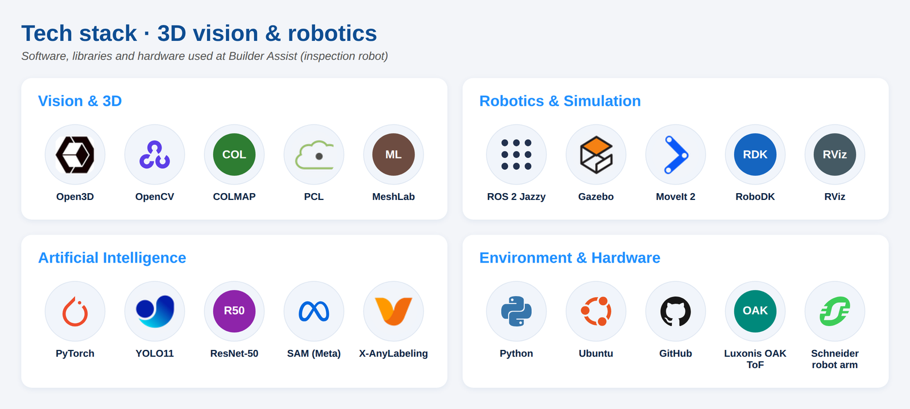

# Asma Kerkouri

> **What I work on:** taking AI models from a prototype to a service that runs reliably in production. I automate the whole path — containers, CI/CD, infrastructure as code, Kubernetes, monitoring — and I apply it to computer vision (2D/3D), LLM agents and data pipelines.

I'm a **DevOps & AI engineer** in Île-de-France, with a double Master's degree in computer science (IoT & distributed systems · advanced information systems).

🔭 **Currently:** looking for a permanent DevOps / MLOps position · building ML platforms on Kubernetes
&nbsp;&nbsp;•&nbsp;&nbsp; 🌱 **Interests:** MLOps · 3D vision · trustworthy RAG · Edge AI
&nbsp;&nbsp;•&nbsp;&nbsp; 💬 **Ask me about** point-cloud registration, CI/CD for ML, and hybrid retrieval

## ☁️ DevOps, MLOps & infrastructure

- **[k8s-terraform-ml-platform](https://github.com/asmakerkouri/k8s-terraform-ml-platform)** — AWS EKS in Terraform, Helm chart for a model API (HPA, PDB, probes), Prometheus/Grafana · *IaC CI with Trivy*
- **[mlops-yolo-fastapi](https://github.com/asmakerkouri/mlops-yolo-fastapi)** — YOLO11 training as a DVC pipeline tracked in MLflow, monitored FastAPI, CI/CD to GHCR / AWS ECR · *mAP50 0.77*
- **[gitops-argocd-ml](https://github.com/asmakerkouri/gitops-argocd-ml)** — GitOps with Argo CD: app of apps, dev/prod ApplicationSet, promotion by pull request, Sealed Secrets

## 👁️ Computer vision 2D / 3D

- **[point-cloud-defect-inspection](https://github.com/asmakerkouri/point-cloud-defect-inspection)** — 3D quality control: FPFH + ICP registration, deviation map, DBSCAN classification of bumps, hollows and cracks · *Open3D*
- **[pose-estimation-analytics](https://github.com/asmakerkouri/pose-estimation-analytics)** — human skeleton detection (17 keypoints), joint angles, posture, repetition counter, ONNX 30 % faster on CPU · *YOLO11-pose*
- **[ros2-slam-turtlebot3](https://github.com/asmakerkouri/ros2-slam-turtlebot3)** — autonomous exploration and real-time SLAM mapping in Gazebo, headless in Docker · *ROS 2 Jazzy*

## 🧠 LLMs & agents

- **[arxiv-rag-multiagent](https://github.com/asmakerkouri/arxiv-rag-multiagent)** — research assistant as a LangGraph agent graph: hybrid BM25 + vector retrieval fused with RRF, cited answers via AWS Bedrock, benchmark on BEIR SciFact

## 📊 Data engineering, statistics & Edge AI

- **[spark-taxi-lakehouse](https://github.com/asmakerkouri/spark-taxi-lakehouse)** — PySpark medallion pipeline on 5 M rows: data-quality quarantine, partitioned Parquet (6× faster queries), MLlib, Airflow · *Big Data*
- **[r-survival-analysis](https://github.com/asmakerkouri/r-survival-analysis)** — Kaplan-Meier, log-rank tests and Cox model on a public lung-cancer cohort, R Markdown report · *R*
- **[edge-ai-iot-streaming](https://github.com/asmakerkouri/edge-ai-iot-streaming)** — MQTT streaming forecasts with XGBoost, Grafana, 7 KB TFLite model for Raspberry Pi · *IoT*

## 🤖 3D vision & robotics in industry

At **Builder Assist** (construction-site inspection robot) and during my Master's projects I built the 3D perception chain end to end:

- **Real-time surface-defect detection** combining 3D point clouds and supervised learning (YOLO11, ResNet-50, SAM-assisted labelling with X-AnyLabeling)
- **3D photogrammetry & ToF acquisition** with a **Luxonis OAK ToF camera**, reconstruction with COLMAP and MeshLab
- **Multi-scan stitching & registration** of point clouds (ICP / NDT with Open3D and PCL) onto the reference geometry
- **Skeleton algorithm driving a Schneider Electric robot arm**, with the perception modules integrated as **ROS 2** nodes (MoveIt 2, RViz, Gazebo simulation, RoboDK)
- **Embedded optimisation** with CUDA/cuDNN and **Docker** packaging on Ubuntu

Industrial code is private; public, reproducible versions of these techniques are in the repositories above.

## 💼 Experience

- **3D Vision Engineer & Industrialisation** — *Builder Assist*, Toulouse · 2025–2026 — 3D perception for a construction-site inspection robot: defect detection, ToF photogrammetry, point-cloud stitching, skeleton algorithm for the Schneider robot arm, ROS 2
- **Backend & AI Integration / LLMOps Developer** — *Octa Digital*, remote (UK) · 2023–2024 — FastAPI services, RAG in production, GitLab CI / GitHub Actions pipelines
- **ML Engineer, Medical Vision** — *Lab. PRISME, Polytech Orléans & CHU* · 2022 — VGG16 / ResNet-50 for COVID and pneumonia X-rays
- **Real-time Data Integration Engineer** — *Yassir*, Algiers · 2020 — GPS noise filtering and trajectory smoothing

🎓 MSc Computer Science (IoT Services & Systems), Université Gustave Eiffel · MSc Advanced Information Systems, Université Hassiba Ben Bouali · 🌍 French · English · Turkish (basic)

---

### 📊 GitHub activity

